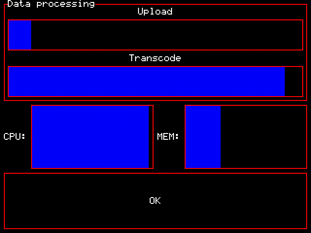
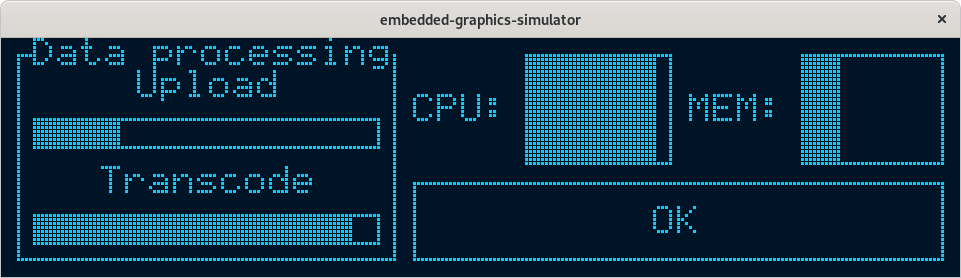

# `emui`

A lightweight embedded user interface toolkit.

## Features

  * Built on top of `embedded-graphics`.
  * Uses a flexbox layout engine (`stretch`) so advanced layouts are possible, e.g. that are responsive to screen 
    resolution.
  * Very low memory footprint.
  * No dynamic dispatch; all code is inlinable and resulting code size is tiny.
  * No allocator needed.
  * Supports basic themeing.

## Examples

All of the following examples run the same business logic but with different displays/themes.  The code is in the
[kitchen_sink](./examples/kitchen_sink.rs) file.

You can run them yourself with one of:

```shell
# monochrome example
$ cargo run --example kitchen_sink --release monochrome
# RGB example
$ cargo run --example kitchen_sink --release rgb
```

### Monochrome


### RGB



### Responsive layout

This is still running exactly the same code as above, just with a different display size.

